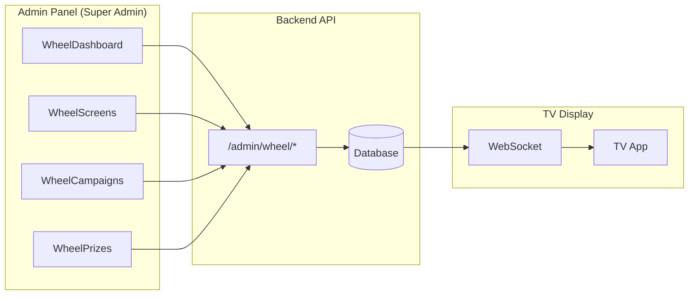

# 🎯 Wheel Module - Backend API Documentation

> **Documento para o time de Backend**  
> Gerado em: 19/01/2026  
> Autor: Frontend Team

## Sumário

1. [Visão Geral](#visão-geral)
2. [Autenticação e Permissões](#autenticação-e-permissões)
3. [Endpoints - Screens (TVs)](#endpoints---screens-tvs)
4. [Endpoints - Campaigns](#endpoints---campaigns)
5. [Endpoints - Segments](#endpoints---segments)
6. [Endpoints - Prizes](#endpoints---prizes)
7. [Endpoints - Inventory](#endpoints---inventory)
8. [Endpoints - Analytics & Logs](#endpoints---analytics--logs)
9. [Funcionalidades Faltantes (Sugestões)](#funcionalidades-faltantes-sugestões)
10. [KPIs e Métricas Necessárias](#kpis-e-métricas-necessárias)
11. [Perguntas para Alinhamento](#perguntas-para-alinhamento)

---

## Visão Geral

O módulo **Roleta nas TVs** permite gerenciar um sistema de sorteio interativo exibido em TVs/totens nas vitrines das lojas. 

### Arquitetura de Alto Nível



### Base URL

```
/api/v1/admin/wheel
```

---

## Autenticação e Permissões

### Requisitos

| Aspecto | Valor |
|---------|-------|
| **Autenticação** | Bearer Token (JWT) |
| **Permissão Necessária** | `wheel.admin` |
| **Roles Permitidas** | `super_admin` ou equivalente |

### Dúvidas

> [!IMPORTANT]
> 1. A permissão `wheel.admin` já existe ou precisa ser criada?
> 2. Deve ser associada a quais roles por padrão?
> 3. Haverá permissões granulares (ex: `wheel.screens.write`, `wheel.campaigns.read`)?

---

## Endpoints - Screens (TVs)

### Enumerações

```typescript
type ScreenStatus = 'active' | 'inactive' | 'maintenance';
```

---

### `GET /admin/wheel/screens`

Lista todas as TVs/totens cadastrados.

**Query Parameters:**

| Param | Tipo | Descrição |
|-------|------|-----------|
| `store_id` | integer | Filtrar por loja |
| `status` | string | `active`, `inactive`, `maintenance` |
| `search` | string | Busca por nome ou screen_key |
| `online_only` | boolean | Apenas TVs online |
| `offline_only` | boolean | Apenas TVs offline |
| `page` | integer | Página (padrão: 1) |
| `per_page` | integer | Itens por página (padrão: 15) |

**Response (200):**

```json
{
  "success": true,
  "data": [
    {
      "id": 1,
      "screen_key": "screen-tijucas-001",
      "name": "Vitrine Principal",
      "status": "active",
      "status_label": "Ativa",
      "status_color": "#22c55e",
      "store": {
        "id": 1,
        "name": "Tijucas",
        "city": "Tijucas"
      },
      "store_id": 1,
      "device_info": {
        "user_agent": "Mozilla/5.0...",
        "resolution": "1920x1080"
      },
      "is_online": true,
      "last_seen_at": "2026-01-19T00:00:00Z",
      "last_seen_ago": "há 2 minutos",
      "active_campaign": {
        "id": 1,
        "campaign_key": "camp_verao_2026",
        "name": "Campanha Verão 2026",
        "status": "active"
      },
      "created_at": "2026-01-01T00:00:00Z",
      "updated_at": "2026-01-19T00:00:00Z"
    }
  ],
  "meta": {
    "current_page": 1,
    "per_page": 15,
    "total": 10,
    "last_page": 1,
    "from": 1,
    "to": 10
  }
}
```

---

### `GET /admin/wheel/screens/{screen_key}`

Retorna detalhes de uma TV específica.

**Response (200):**

```json
{
  "success": true,
  "data": {
    "id": 1,
    "screen_key": "screen-tijucas-001",
    "name": "Vitrine Principal",
    "status": "active",
    "status_label": "Ativa",
    "status_color": "#22c55e",
    "store": { "id": 1, "name": "Tijucas", "city": "Tijucas" },
    "store_id": 1,
    "device_info": { "user_agent": "...", "resolution": "1920x1080" },
    "is_online": true,
    "last_seen_at": "2026-01-19T00:00:00Z",
    "last_seen_ago": "há 2 minutos",
    "active_campaign": { "id": 1, "campaign_key": "camp_verao_2026", "name": "Campanha Verão 2026", "status": "active" },
    "created_at": "2026-01-01T00:00:00Z",
    "updated_at": "2026-01-19T00:00:00Z"
  }
}
```

---

### `POST /admin/wheel/screens`

Cria uma nova TV.

**Request Body:**

```json
{
  "store_id": 1,
  "name": "Vitrine 01",
  "screen_key": "screen-tijucas-001",  // opcional, gerado automaticamente
  "status": "active"  // opcional, padrão: active
}
```

**Response (201):**

```json
{
  "success": true,
  "data": {
    "screen": { /* WheelScreen object */ },
    "token": "eyJhbGciOiJIUzI1NiIsInR5cCI6IkpXVCJ9..."
  },
  "message": "TV criada com sucesso. Salve o token pois não será exibido novamente."
}
```

> [!CAUTION]
> O `token` deve ser exibido **apenas uma vez** na criação. Armazenar apenas o hash no banco.

---

### `PUT /admin/wheel/screens/{screen_key}`

Atualiza uma TV existente.

**Request Body:**

```json
{
  "store_id": 2,
  "name": "Vitrine Atualizada",
  "status": "maintenance"
}
```

---

### `DELETE /admin/wheel/screens/{screen_key}`

Exclui uma TV.

---

### `POST /admin/wheel/screens/{screen_key}/rotate-secret`

Gera um novo token de autenticação, invalidando o anterior.

**Response (200):**

```json
{
  "success": true,
  "data": { "token": "novo-token-jwt..." },
  "message": "Token regenerado. Salve-o agora."
}
```

---

### `POST /admin/wheel/screens/{screen_key}/set-status`

Altera o status da TV.

**Request Body:**

```json
{ "status": "maintenance" }
```

---

### `GET /admin/wheel/screens/{screen_key}/health`

Retorna informações de conectividade/saúde da TV.

**Response (200):**

```json
{
  "success": true,
  "data": {
    "screen_key": "screen-tijucas-001",
    "name": "Vitrine Principal",
    "store": "Tijucas",
    "status": "active",
    "status_label": "Ativa",
    "is_online": true,
    "last_seen_at": "2026-01-19T00:00:00Z",
    "last_seen_ago": "há 2 minutos",
    "device_info": {
      "user_agent": "Mozilla/5.0...",
      "resolution": "1920x1080"
    },
    "active_campaign": { "campaign_key": "camp_verao_2026", "name": "Campanha Verão 2026", "status": "active" }
  }
}
```

---

### `GET /admin/wheel/screens/{screen_key}/campaigns`

Lista campanhas vinculadas a uma TV.

**Response (200):**

```json
{
  "success": true,
  "data": [
    {
      "id": 1,
      "campaign_key": "camp_verao_2026",
      "name": "Campanha Verão 2026",
      "status": "active",
      "is_active_on_screen": true
    }
  ]
}
```

---

### `PUT /admin/wheel/screens/{screen_key}/campaigns`

Sincroniza quais campanhas estão disponíveis para uma TV.

**Request Body:**

```json
{ "campaign_ids": [1, 2, 3] }
```

---

### `POST /admin/wheel/screens/{screen_key}/campaigns/{campaign_key}/activate`

Ativa uma campanha específica em uma TV.

---

## Endpoints - Campaigns

### Enumerações

```typescript
type CampaignStatus = 'draft' | 'active' | 'paused' | 'ended';
type PerPhoneLimit = '1_per_campaign' | '1_per_day' | 'unlimited';
```

---

### `GET /admin/wheel/campaigns`

Lista todas as campanhas.

**Query Parameters:**

| Param | Tipo | Descrição |
|-------|------|-----------|
| `status` | string | `draft`, `active`, `paused`, `ended` |
| `search` | string | Busca por nome |
| `page` | integer | Página |
| `per_page` | integer | Itens por página |

**Response (200):**

```json
{
  "success": true,
  "data": [
    {
      "id": 1,
      "campaign_key": "camp_verao_2026",
      "name": "Campanha Verão 2026",
      "status": "active",
      "status_label": "Ativa",
      "status_color": "#22c55e",
      "status_icon": "play",
      "can_activate": false,
      "can_pause": true,
      "can_end": true,
      "starts_at": "2026-01-01T00:00:00Z",
      "ends_at": "2026-02-28T23:59:59Z",
      "is_within_period": true,
      "terms_version": "v1.0",
      "settings": {
        "qr_ttl_seconds": 120,
        "spin_duration_ms": 5000,
        "min_rotations": 3,
        "max_rotations": 6,
        "max_queue_size": 5,
        "per_phone_limit": "1_per_day"
      },
      "screens_count": 3,
      "active_segments_count": 8,
      "total_weight": 100,
      "created_at": "2026-01-01T00:00:00Z",
      "updated_at": "2026-01-19T00:00:00Z"
    }
  ],
  "meta": { /* paginação */ }
}
```

---

### `GET /admin/wheel/campaigns/{campaign_key}`

Retorna detalhes de uma campanha (inclui `segments` e `inventory`).

---

### `POST /admin/wheel/campaigns`

Cria nova campanha.

**Request Body:**

```json
{
  "name": "Campanha Verão 2026",
  "campaign_key": "camp_verao_2026",  // opcional
  "starts_at": "2026-01-01T00:00:00Z",  // opcional
  "ends_at": "2026-02-28T23:59:59Z",  // opcional
  "terms_version": "v1.0",  // opcional
  "settings": {  // opcional, usar defaults
    "qr_ttl_seconds": 120,
    "spin_duration_ms": 5000,
    "min_rotations": 3,
    "max_rotations": 6,
    "max_queue_size": 5,
    "per_phone_limit": "1_per_day"
  }
}
```

---

### `PUT /admin/wheel/campaigns/{campaign_key}`

Atualiza campanha.

---

### `DELETE /admin/wheel/campaigns/{campaign_key}`

Exclui campanha (apenas status `draft`).

---

### `POST /admin/wheel/campaigns/{campaign_key}/activate`

Ativa a campanha.

---

### `POST /admin/wheel/campaigns/{campaign_key}/pause`

Pausa a campanha.

---

### `POST /admin/wheel/campaigns/{campaign_key}/end`

Encerra a campanha permanentemente.

---

## Endpoints - Segments

### `GET /admin/wheel/campaigns/{campaign_key}/segments`

Lista segmentos de uma campanha (fatias da roleta).

**Response (200):**

```json
{
  "success": true,
  "data": [
    {
      "id": 1,
      "segment_key": "seg_pelicula_001",
      "label": "Película Grátis",
      "color": "#EF4444",
      "prize_id": 1,
      "prize": {
        "id": 1,
        "prize_key": "prize_pelicula",
        "name": "Película Premium",
        "type": "product",
        "icon": "🎁",
        "active": true
      },
      "probability_weight": 10,
      "probability_percentage": 10.0,
      "sort_order": 1,
      "active": true,
      "created_at": "2026-01-01T00:00:00Z",
      "updated_at": "2026-01-19T00:00:00Z"
    }
  ]
}
```

---

### `PUT /admin/wheel/campaigns/{campaign_key}/segments`

**Sincroniza** todos os segmentos (upsert em lote).

**Request Body:**

```json
{
  "segments": [
    {
      "id": 1,  // se existir, atualiza; senão, ignora (ou cria?)
      "segment_key": "seg_pelicula_001",
      "label": "Película Grátis",
      "color": "#EF4444",
      "prize_id": 1,
      "probability_weight": 10,
      "active": true
    },
    {
      "label": "Novo Segmento",  // sem id = criação
      "color": "#22C55E",
      "prize_id": 2,
      "probability_weight": 5,
      "active": true
    }
  ]
}
```

> [!NOTE]
> **Comportamento esperado:**
> - Segmentos com `id` existente: **UPDATE**
> - Segmentos sem `id`: **INSERT**
> - Segmentos não presentes na lista: **DELETE** (ou manter?)

---

### `POST /admin/wheel/campaigns/{campaign_key}/segments`

Cria um único segmento.

---

### `DELETE /admin/wheel/campaigns/{campaign_key}/segments/{segment_id}`

Exclui um segmento.

---

## Endpoints - Prizes

### Enumerações

```typescript
type PrizeType = 'product' | 'coupon' | 'nothing' | 'try_again';
```

### Comportamento por Tipo

| Tipo | `requires_redeem` | `consumes_inventory` | Descrição |
|------|-------------------|---------------------|-----------|
| `product` | true | true | Prêmio físico, requer resgate |
| `coupon` | true | true | Cupom de desconto |
| `nothing` | false | false | "Não foi dessa vez" |
| `try_again` | false | false | "Tente novamente" |

---

### `GET /admin/wheel/prizes`

Lista catálogo de prêmios.

**Query Parameters:**

| Param | Tipo |
|-------|------|
| `type` | string |
| `active` | boolean |
| `search` | string |
| `page`, `per_page` | integer |

**Response (200):**

```json
{
  "success": true,
  "data": [
    {
      "id": 1,
      "prize_key": "prize_pelicula",
      "name": "Película Premium",
      "type": "product",
      "type_label": "Produto",
      "type_icon": "gift",
      "type_color": "#3B82F6",
      "icon": "🎁",
      "description": "Película de vidro premium para qualquer modelo",
      "redeem_instructions": "Apresente o código no caixa para resgatar",
      "code_prefix": "MC-",
      "requires_redeem": true,
      "consumes_inventory": true,
      "active": true,
      "segments_count": 3,
      "created_at": "2026-01-01T00:00:00Z",
      "updated_at": "2026-01-19T00:00:00Z"
    }
  ],
  "meta": { /* paginação */ }
}
```

---

### `GET /admin/wheel/prizes/{prize_key}`

Retorna detalhes do prêmio.

---

### `POST /admin/wheel/prizes`

Cria novo prêmio.

**Request Body:**

```json
{
  "name": "Película Premium",
  "type": "product",
  "prize_key": "prize_pelicula",  // opcional
  "icon": "🎁",  // opcional
  "description": "...",  // opcional
  "redeem_instructions": "...",  // opcional
  "code_prefix": "MC-",  // opcional
  "active": true  // opcional, padrão: true
}
```

---

### `PUT /admin/wheel/prizes/{prize_key}`

Atualiza prêmio.

---

### `DELETE /admin/wheel/prizes/{prize_key}`

Exclui prêmio.

---

### `POST /admin/wheel/prizes/{prize_key}/toggle`

Alterna status ativo/inativo.

---

## Endpoints - Inventory

### `GET /admin/wheel/campaigns/{campaign_key}/inventory`

Lista estoque de prêmios para uma campanha.

**Response (200):**

```json
{
  "success": true,
  "data": [
    {
      "id": 1,
      "campaign_id": 1,
      "prize_id": 1,
      "prize": {
        "id": 1,
        "prize_key": "prize_pelicula",
        "name": "Película Premium",
        "type": "product",
        "icon": "🎁"
      },
      "total_limit": 100,
      "remaining": 45,
      "remaining_percentage": 45.0,
      "daily_limit": 10,
      "daily_remaining": 3,
      "reset_daily_at": "2026-01-20T00:00:00Z",
      "has_stock": true,
      "needs_daily_reset": false,
      "created_at": "2026-01-01T00:00:00Z",
      "updated_at": "2026-01-19T00:00:00Z"
    }
  ]
}
```

---

### `PUT /admin/wheel/campaigns/{campaign_key}/inventory`

Sincroniza estoque.

**Request Body:**

```json
{
  "inventory": [
    {
      "prize_id": 1,
      "total_limit": 100,
      "remaining": 100,
      "daily_limit": 10,
      "daily_remaining": 10
    }
  ]
}
```

---

### `POST /admin/wheel/campaigns/{campaign_key}/inventory/{prize_key}/add`

Adiciona mais unidades ao estoque.

**Request Body:**

```json
{ "quantity": 50 }
```

---

### `POST /admin/wheel/campaigns/{campaign_key}/inventory/{prize_key}/reset-daily`

Reseta o contador diário para o limite configurado.

---

## Endpoints - Analytics & Logs

### `GET /admin/wheel/analytics/summary`

Retorna resumo para o dashboard.

**Response (200):**

```json
{
  "success": true,
  "data": {
    "screens": {
      "total": 10,
      "online": 8,
      "offline": 2
    },
    "campaigns": {
      "active": 2,
      "draft": 3
    },
    "today": {
      "spins": 156,
      "prizes_won": 45
    },
    "events_24h": 523
  }
}
```

---

### `GET /admin/wheel/logs/events`

Lista eventos do sistema (logs).

**Query Parameters:**

| Param | Tipo | Descrição |
|-------|------|-----------|
| `screen_key` | string | Filtrar por TV |
| `campaign_key` | string | Filtrar por campanha |
| `type` | string | Tipo de evento (ver lista abaixo) |
| `from` | datetime | Data inicial |
| `to` | datetime | Data final |
| `page`, `per_page` | integer | Paginação |

**Event Types:**

```typescript
type WheelEventType =
  | 'screen_connected'
  | 'screen_disconnected'
  | 'campaign_activated'
  | 'campaign_paused'
  | 'campaign_ended'
  | 'spin_started'
  | 'spin_completed'
  | 'prize_won'
  | 'inventory_depleted'
  | 'config_changed';
```

**Response (200):**

```json
{
  "success": true,
  "data": [
    {
      "id": 1,
      "event_id": "evt_abc123",
      "type": "prize_won",
      "screen": { "screen_key": "screen-tijucas-001", "name": "Vitrine Principal" },
      "campaign": { "campaign_key": "camp_verao_2026", "name": "Campanha Verão 2026" },
      "payload": {
        "prize_key": "prize_pelicula",
        "prize_name": "Película Premium",
        "phone_hash": "abc...xyz",
        "code": "MC-A1B2C3"
      },
      "created_at": "2026-01-19T00:00:00Z",
      "created_at_human": "há 5 minutos"
    }
  ],
  "meta": { /* paginação */ }
}
```

---

## Funcionalidades Faltantes (Sugestões)

### Frontend - Páginas que precisam ser criadas

| Funcionalidade | Status | Descrição |
|----------------|--------|-----------|
| ✅ Create Screen | Implementado | Modal de criação |
| ⚠️ **Edit Screen** | **Faltando** | Endpoint existe, modal não |
| ✅ Create Campaign | Implementado | Modal de criação |
| ⚠️ **Edit Campaign** | **Faltando** | Endpoint existe, modal não |
| ✅ Create Prize | Implementado | Modal de criação |
| ⚠️ **Edit Prize** | **Faltando** | Endpoint existe, modal não |
| ⚠️ **Duplicate Campaign** | **Faltando** | `POST /campaigns/{key}/duplicate` |
| ⚠️ **Bulk Operations** | **Faltando** | Ativar/pausar múltiplas campanhas |
| ⚠️ **Export Logs** | **Faltando** | `GET /logs/events/export?format=csv` |

### Backend - Endpoints Sugeridos

#### 1. Duplicar Campanha

```http
POST /admin/wheel/campaigns/{campaign_key}/duplicate
```

**Request:**
```json
{ "new_name": "Campanha Verão 2026 (Cópia)" }
```

**Response:**
```json
{ "success": true, "data": { /* nova campanha */ } }
```

---

#### 2. Exportar Logs

```http
GET /admin/wheel/logs/events/export
```

**Query Params:** mesmos do `GET /logs/events` + `format=csv|xlsx`

---

#### 3. Reordenar Segmentos

```http
POST /admin/wheel/campaigns/{campaign_key}/segments/reorder
```

**Request:**
```json
{ "order": [3, 1, 2, 4] }  // array de segment_ids na nova ordem
```

---

#### 4. Preview da Roleta (Dados para renderização)

```http
GET /admin/wheel/campaigns/{campaign_key}/preview
```

**Response:**
```json
{
  "success": true,
  "data": {
    "segments": [
      { "label": "Película", "color": "#EF4444", "percentage": 10 },
      { "label": "Cupom 10%", "color": "#22C55E", "percentage": 25 }
    ],
    "settings": { "spin_duration_ms": 5000 }
  }
}
```

---

## KPIs e Métricas Necessárias

### Dashboard - Métricas Atuais

| Métrica | Fonte | Descrição |
|---------|-------|-----------|
| TVs Online/Total | `analytics/summary` | Contagem de telas conectadas |
| Campanhas Ativas | `analytics/summary` | Campanhas com status `active` |
| Giros Hoje | `analytics/summary` | Total de `spin_completed` do dia |
| Prêmios Ganhos | `analytics/summary` | Total de `prize_won` do dia |

### Dashboard - Métricas Sugeridas (Novas)

> [!IMPORTANT]
> Precisamos de mais métricas para um dashboard completo. Sugestões:

#### KPIs Adicionais Necessários

```json
{
  "today": {
    "spins": 156,
    "prizes_won": 45,
    "unique_participants": 120,       // telefones únicos
    "conversion_rate": 29.0,          // % prêmios / giros
    "avg_spins_per_participant": 1.3  // média de giros por pessoa
  },
  "week": {
    "spins": 892,
    "prizes_won": 234,
    "top_prize": {
      "name": "Película Premium",
      "count": 45
    }
  },
  "inventory_alerts": [
    {
      "campaign_key": "camp_verao_2026",
      "prize_key": "prize_pelicula",
      "prize_name": "Película Premium",
      "remaining": 5,
      "alert_level": "critical"  // low < 20%, critical < 5%
    }
  ],
  "screens_needing_attention": [
    {
      "screen_key": "screen-bc-001",
      "name": "Vitrine BC",
      "issue": "offline_24h",
      "last_seen": "2026-01-18T00:00:00Z"
    }
  ]
}
```

---

#### Endpoint Sugerido: Analytics Detalhado

```http
GET /admin/wheel/analytics/detailed
```

**Query Params:**

| Param | Tipo |
|-------|------|
| `period` | `today`, `week`, `month`, `custom` |
| `from` | datetime |
| `to` | datetime |
| `campaign_key` | string (opcional) |
| `store_id` | integer (opcional) |

**Response:**

```json
{
  "success": true,
  "data": {
    "period": { "from": "2026-01-01", "to": "2026-01-19" },
    
    "totals": {
      "spins": 5234,
      "prizes_won": 1456,
      "unique_phones": 3200,
      "conversion_rate": 27.8
    },
    
    "by_day": [
      { "date": "2026-01-18", "spins": 156, "prizes": 45 },
      { "date": "2026-01-19", "spins": 142, "prizes": 38 }
    ],
    
    "by_campaign": [
      { "campaign_key": "camp_verao_2026", "name": "Verão 2026", "spins": 3000, "prizes": 850 }
    ],
    
    "by_store": [
      { "store_id": 1, "store_name": "Tijucas", "spins": 1200, "prizes": 340 }
    ],
    
    "by_prize": [
      { "prize_key": "prize_pelicula", "name": "Película", "count": 234, "percentage": 16.1 }
    ],
    
    "hourly_distribution": [
      { "hour": 10, "spins": 45 },
      { "hour": 11, "spins": 78 }
    ]
  }
}
```

---

## Perguntas para Alinhamento

### Arquitetura

1. **WebSocket ou Polling?**
   - Como a TV recebe atualizações de configuração?
   - Sugestão: WebSocket para real-time (ideal) ou polling a cada 30s

2. **Heartbeat da TV:**
   - Qual o intervalo esperado para considerar uma TV online?
   - Sugestão: 60 segundos

3. **Autenticação da TV:**
   - O token JWT da TV tem expiração?
   - Precisa renovar automaticamente?

### Negócio

4. **Limite por telefone:**
   - `1_per_campaign` = 1 giro por campanha inteira?
   - `1_per_day` = reset à meia-noite (horário local ou UTC)?
   - Se o telefone já participou, exibe mensagem ou permite girar sem prêmio?

5. **Inventário zerado:**
   - O que acontece quando um prêmio atinge limite 0?
   - Opções: (a) Segmento fica inativo, (b) Sorteio redistribui peso, (c) Exibe "esgotado"

6. **Segmentos inativos:**
   - Segmentos com `active: false` ainda aparecem na roleta (opaco) ou somem?

7. **Período da campanha:**
   - `starts_at/ends_at` são validados no sorteio ou apenas informativos?

8. **Códigos de resgate:**
   - Formato: `{code_prefix}{random}` (ex: `MC-A1B2C3`)?
   - Comprimento do random?
   - Validação de unicidade?

### Segurança

9. **Anti-fraude:**
   - Validação de telefone (formato, já participou)?
   - Rate limiting por IP/phone?
   - Logs de tentativas suspeitas?

10. **Token da TV:**
    - Expiração? Renovação?
    - Revogação remota (além de rotate-secret)?

### Performance

11. **Cache:**
    - Analytics summary pode ser cacheado? TTL sugerido: 60s
    - Lista de segmentos da campanha: cache com invalidação em update

12. **Limites:**
    - Máximo de segmentos por campanha?
    - Máximo de campanhas por TV?
    - Máximo de TVs por loja?

---

## Checklist de Implementação Backend

### Prioridade Alta (MVP)

- [ ] Tabelas: `wheel_screens`, `wheel_campaigns`, `wheel_segments`, `wheel_prizes`, `wheel_inventory`, `wheel_events`
- [ ] CRUD completo de Screens
- [ ] CRUD completo de Campaigns
- [ ] CRUD completo de Prizes
- [ ] Sync de Segments
- [ ] Analytics Summary básico
- [ ] Logs/Events

### Prioridade Média

- [ ] Inventory management
- [ ] Duplicate campaign
- [ ] Reorder segments
- [ ] Analytics detalhado

### Prioridade Baixa

- [ ] Export logs (CSV)
- [ ] Bulk operations
- [ ] Alertas de inventário baixo
- [ ] Notificações de TV offline

---

## Considerações Finais

O frontend está **100% implementado** e aguardando os endpoints. Todos os JSON schemas acima refletem exatamente o que o frontend espera receber.

> [!TIP]
> Recomendamos criar um ambiente de staging para testes integrados antes do deploy em produção.

**Contato Frontend:** [seu-email@maiscapinhas.com]
